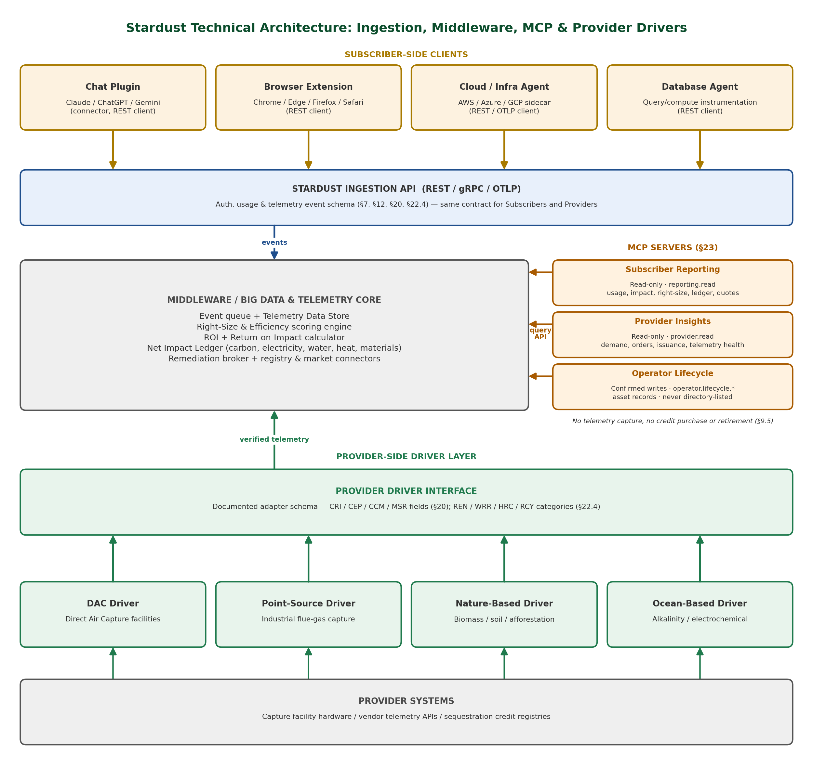

# Project Stardust

**The AIforE Subscriber Plugin.** Stardust is open-source metering for AI and cloud usage. Wherever a token is generated or a query runs, it records what was used, what it cost, and what it cost the planet (electricity, CO₂e, water). It shows the result as a compact code such as `B2-M`, and it can route residual emissions to vetted carbon-removal providers.

A project of [AI for Ecology](https://aifore.org). See the [spec (v1.2) and summary](docs/).

## How it fits together

<picture>
  <source media="(prefers-color-scheme: dark)" srcset="stardust-technical-architecture-dark.png">
  
</picture>

```
 subscriber-client/            middleware/                     providers-service/
 ───────────────────           ──────────────────────          ────────────────────
 browser extension  ──events─▶ Stardust Core                   Remediation Provider SDK
 chat connectors               · cost (litellm pricing)        · reforestation, blue carbon,
 infra SDKs                    · energy / CO₂e / water           DAC, biochar …
                   ◀─code───── · indicator code + job ID
                               · Remediation Broker ◀─────────▶ providers (vetted, tiered)
                   ──quotes──▶   (subscriber API)
                                          │
                               schema/  (the open standard all three share)
```

| Directory | What it is | Spec |
|---|---|---|
| [`schema/`](schema/) | Event schemas, Energy Source Codes and the versioned methodology factors | §5, §7, §8, §10.5, §20 |
| [`middleware/`](middleware/) | Stardust Core: ingestion, enrichment and the remediation broker (Python/FastAPI) | §8–§11 |
| [`subscriber-client/`](subscriber-client/) | Clients that capture usage: the Chrome/Edge extension for now (TypeScript) | §6, §12 |
| [`providers-service/`](providers-service/) | The interface remediation providers implement, a mock provider, and carbon-capture telemetry models | §10.2, §20 |
| [`docs/`](docs/) | The product spec and summary | |

## Status: v0.1 scaffold

This is the Phase 1 foundation (§16). The methodology factors are a **draft**, and some are placeholders awaiting review (see [`schema/README.md`](schema/README.md)). Core stores its data in a single SQLite file (see [the database design](docs/architecture/database.md)), and the extension's figures are estimates.

## Where it's going

Spec v1.2 extends Stardust beyond carbon to **five impact dimensions** (carbon, electricity, water, heat and materials), matched like for like with renewable energy certificates, water restoration certificates, heat-reuse and recycling credits through registry and market connectors. It also splits carbon into lifecycle components (inference, facility, training, embodied hardware). The architecture and the step-by-step plan for building this without disrupting what already runs are in [`docs/architecture/impact-credits.md`](docs/architecture/impact-credits.md).

## Quick start

```bash
python3 -m venv ~/.venvs/stardust
~/.venvs/stardust/bin/pip install -e "middleware[dev]" -e "providers-service[dev]"
~/.venvs/stardust/bin/pytest middleware providers-service
cd middleware && ~/.venvs/stardust/bin/uvicorn stardust_core.main:app --port 8080
```

Then build and load the [browser extension](subscriber-client/browser-extension/).

## License

Code is licensed under the [Apache License 2.0](LICENSE). The pricing data in `middleware/data/` comes from [BerriAI/litellm](https://github.com/BerriAI/litellm) (MIT). The Stardust and AIforE names and the indicator visual language are trademarks, handled separately from the code license (§17.3).
