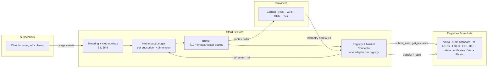

# Multi-attribute impact credits and lifecycle emissions

The architecture for spec v1.2 §22 (renewable energy, water, heat recovery and materials credits) and §8.8 (lifecycle emissions): what they add to Stardust, how they fit the existing Core, and the incremental, non-destructive plan for building them.

**Status:** designed, not yet built. Today Stardust meters the carbon, electricity and water footprint of AI usage, and its broker handles carbon remediation only. Each step below changes that without breaking anything already running.

## What v1.2 adds

### Five impact dimensions, matched like for like (§22.1–§22.2)

| Dimension | Subscriber footprint | Provider benefit | Credit instruments | Unit | Maturity |
|---|---|---|---|---|---|
| Carbon | CO₂e, full lifecycle (§8.8) | Removal or avoidance | Verra VCS, Gold Standard, ACR, CAR, Puro.earth | tCO₂e | Mature |
| Electricity | kWh, by hour and grid region | Renewable generation | RECs (M-RETS, PJM-GATS, WREGIS), EU Guarantees of Origin, I-RECs; EnergyTag granular certificates for hourly matching | MWh | Mature (annual), emerging (hourly) |
| Water | Liters consumed (WUE) | Water restored, recycled or remediated | BEF Water Restoration Certificates (1 = 1,000 gal); WRI Volumetric Water Benefit Accounting | 1,000 gal / m³ | Emerging |
| Heat | Waste heat rejected | Waste heat delivered for reuse | White certificates (France CEE, Italy TEE); carbon credits for displaced fossil heat; ERF (ISO/IEC 30134-6) as the measure | MWh-th / tCO₂e | Emerging, jurisdiction-specific |
| Materials | Embodied hardware, e-waste | Recycling and recovery | Verra Plastic Waste Reduction; e-waste recovery attested by R2 / e-Stewards recyclers | kg / t | Emerging |

The rules that shape the design:

- **Like for like.** A credit only answers a footprint in its own dimension. A water credit never cancels carbon, and a REC is a Scope 2 electricity claim, not a carbon offset.
- **Register, don't issue.** Stardust supplies measurement and MRV data. Registries verify and issue. Stardust never mints credits.
- **One benefit, one claim.** Each serial is retired once, for one beneficiary and one claim period. The same benefit is never sold as two instruments unless the program allows it.
- **Match in time and place.** Electricity is matched within a market boundary (hourly where possible), water within the same or a stressed watershed, heat to a named local recipient.
- **Dimensions are never summed.** The ledger shows them side by side, never as one blended number.

### New provider categories (§22.3–§22.4)

| Code | Category | Example telemetry (raw, then derived) |
|---|---|---|
| `REN` | Renewable energy generator | `GEN` net generation, `SRC` source type, `GLN` grid location, `CTL` curtailment, `EAC` certificate serials |
| `WRR` | Water restoration and recycling | `VTR` treated/recycled, `VRT` returned, `WQI` quality, `WSI` watershed, `WSX` water stress; derived `D-VWB` |
| `HRC` | Heat recovery | `HEX` heat exported, `HST` temperature, `HRP` recipient, `ERF` energy reuse factor, `DFB` displaced fuel; derived `D-HAV` |
| `RCY` | Materials recycling | `MRC` mass recovered, `MTY` material, `COC` chain of custody, `RCS` certification; derived `D-MAV` |

These sit beside the carbon-capture types from §20 (`DAC`, `PSC`, `NBC`, `OBC`). An operator can be a **prosumer**, both a subscriber and a provider (for example, a data center that exports heat). In that case the broker removes any benefit sold as credits from the operator's own claims.

### New Core components (§22.5–§22.6)

- **Net Impact Ledger.** For each subscriber and dimension, it records the gross footprint, the reductions from right-sizing (§21), the credits retired (by instrument) and the residual. It feeds Return-on-Impact reporting and the dashboards.
- **Registry and Market Connector.** Built on the same driver model as the Provider SDK: one adapter per registry behind one interface, so adding a registry never changes provider or subscriber code.

| Connector method | Purpose |
|---|---|
| `connect(registry_id, credentials)` | Account-holder connection to a registry or market |
| `submit_mrv(provider_id, period, package)` | Provider telemetry and evidence to the verifier (issuance path) |
| `get_issuance(provider_id, period)` | Credits issued for a provider and period |
| `list_inventory(category, filters)` | Available credits by category, vintage, geography, matching basis |
| `transfer(serials, to_account)` | Move credits at purchase |
| `retire(serials, beneficiary, claim_period, purpose)` | Retire in the subscriber's name |
| `verify_serial(serial)` | Check a serial against the public registry |

Many registries have no open write API. Early connectors record retirements performed by the provider, by the buyer's own registry account, or by a licensed partner, and move to API automation where registries allow it. AIforE doesn't hold credits for others (see [operating model](#operating-model-technology-and-connection-not-financial-brokerage)).

### Lifecycle emissions (§8.8)

Carbon splits into components that are always reported separately, each with its own confidence tag:

| Code | Component | How it's derived |
|---|---|---|
| `OPE` | Operational inference | Call energy × grid intensity at run time. This is what Stardust computes today as `co2e_g` |
| `FAC` | Facility overhead | `OPE × (PUE − 1)`, from provider/region PUE |
| `TRA` | Amortized training | Training emissions ÷ lifetime tokens × tokens in the call. Always *Estimated*: no provider publishes lifetime tokens |
| `EMB` | Embodied hardware | Hardware emissions × construction share ÷ (hardware life × utilization) |

`OPE + FAC` map to the Software Carbon Intensity operational term and `EMB` to its embodied term. `TRA` is a disclosed extension.

## How it maps onto today's code

| v1.2 concept | Today | Gap |
|---|---|---|
| Carbon footprint | `co2e_g` on every event (= `OPE`) | `FAC`, `TRA` and `EMB` components |
| Electricity footprint | `energy_wh` on every event | Hourly bucketing and market zone for matching |
| Water footprint | `water_ml` on every event | Watershed for place-based matching |
| Heat footprint | Not measured | Waste heat is roughly the electricity consumed; needs a method in the factor config |
| Materials footprint | Not measured (`ewaste_mg` reserved in the schema) | From `EMB` inputs |
| Provider categories | Carbon remediation categories, §20 carbon-capture telemetry | `REN`, `WRR`, `HRC`, `RCY` and the §22.4 fields |
| Broker quotes | `request_quote(co2e_g)` → carbon quotes | Impact-vector baskets, one quote per dimension |
| Orders | Carbon orders with provider, tier, fee, certificate | `credit_category`, `credit_unit`, `registry_id`, `serial_range`, `vintage_period`, `matching_basis`, `claim_type`, `beneficiary`, `retirement_ref` |
| Net Impact Ledger | `/v1/summary` (footprint only) | Retired credits and residual per dimension |
| Registry connectors | None (providers self-attest certificates) | The connector interface and adapters |

## Incremental, non-destructive plan

### Ground rules for every step

1. **Additive only.**
   - New fields are optional, new tables and endpoints are new, and new enum values extend old ones.
   - The carbon path, the current API responses and the event schema keep working exactly as they do.
   - `request_quote(co2e_g)` stays valid forever; the impact vector is an optional alternative.
2. **Migrations add, never rewrite.** Each database change is a new schema version (v3, v4…) made only of `ADD COLUMN`, `CREATE TABLE` and `CREATE INDEX`. Old rows keep `NULL` in new columns. Each migration is rehearsed on a copy of a real database before it ships, as v2 was.
3. **Behind a switch until proven.** New dimensions are off unless listed in `STARDUST_CREDIT_CATEGORIES` (default `carbon`), so turning a dimension on is a configuration change, and so is turning it off.
4. **Methodology is versioned, not edited.** Lifecycle and heat factors go into a new factor file (`methodology-v0.2.json`). Every event records the methodology version it was computed with, so v0.1 figures never silently change.
5. **Contract tests pin today's behavior.** Before the first change, freeze the current API responses (events, summary, quotes, orders) in tests, so any accidental change to existing behavior fails CI.
6. **One small PR per step,** each shippable on its own, with docs updated in the same PR.

### Steps

| # | Step | What changes | What stays untouched |
|---|---|---|---|
| 0 | **Docs** (this change) | Spec v1.2 in `docs/`; this architecture doc | All code |
| 1 | **Contract tests** | Golden tests for the current API and schemas | All behavior |
| 2 | **Measure every dimension** | Events gain optional `heat_wh_th`, `materials_mg` and lifecycle components (`fac_g`, `tra_g`, `emb_g`) from `methodology-v0.2`; hour and market-zone fields for matching. Schema migration v3 (add columns) | `co2e_g` keeps meaning operational carbon; v0.1 events unchanged |
| 3 | **Net Impact Ledger (read-only)** | `GET /v1/ledger`: footprint per dimension, with retired credits from existing carbon orders and residuals. Nothing summed across dimensions | Summary, orders, broker |
| 4 | **Provider SDK categories** | `REN`, `WRR`, `HRC`, `RCY`; `quote(quantity, unit)` alongside `quote(co2e_g)`; §22.4 telemetry schema as a new record type | Existing carbon providers work unmodified (category defaults to carbon) |
| 5 | **Impact-vector quotes** | `request_quote` optionally takes `{co2e_g, kwh, water_l, heat_kwh_th, materials_kg}` plus matching preferences and returns a basket; like-for-like enforced; fees apply per line. Orders gain the §22.5 fields (migration v4) | `co2e_g`-only requests and responses |
| 6 | **Connector interface + manual connector** | The connector interface, and a manual connector where an admin records retirements (serials, registry, retirement reference) that the provider, buyer or a licensed partner performed in the registry. Stardust verifies them where a read API exists. The ledger shows them | No automated registry calls yet |
| 7 | **Real connectors, one at a time** | Starting with the registry that grants API access first. Hourly matching once a granular-certificate registry is connected | Other connectors |
| 8 | **Publish the measurement framework** (§22.7) | Schemas, units and mappings (SCI, GHG Protocol, ISO/IEC 30134, VWBA, EnergyTag) as a standalone document for public comment | Code |

Steps 1–4 are safe to build now. Steps 5–7 depended on open questions only AIforE can settle (§19). The first answers and research are in [Decisions and findings](#decisions-and-findings-september-2026) below:

- **Legal review** of brokering environmental commodities across markets as a nonprofit.
- **Account holder:** which registries grant programmatic access, and whether AIforE or a licensed partner holds the account.
- **Programs:** which water and heat programs to accept first.

The manual connector (step 6) lets the ledger and the retirement flow be built and tested before any of those are settled.

## Decisions and findings (September 2026)

### Operating model: technology and connection, not financial brokerage

AIforE's intent is to **provide technology and connect credits, not broker them in a financial sense**. That translates into design rules for Stardust. These are engineering constraints that follow from the intent, not legal advice, and the final structure should be confirmed with counsel experienced in environmental markets and nonprofit law.

| Rule | What it means in Stardust | Status today |
|---|---|---|
| **Never take title** | Credits go from the provider's registry account straight to the buyer's, or are retired directly in the buyer's name. AIforE never holds credit inventory | Consistent: the broker routes orders to providers and holds nothing. The spec's phrase "purchases from Provider inventory" (§22.5) should read "the Subscriber purchases from the Provider" |
| **Never hold or move money** | Buyers pay providers directly. Stardust stores only an opaque payment reference | Already true (`payment_ref`, §18.2) |
| **Don't set prices** | Providers quote their own prices; Stardust displays and compares them | Already true |
| **Retire through the seller or a licensed account holder** | Where a registry requires a KYC'd account holder, the provider, the buyer's own account or a licensed partner performs the retirement. Stardust records and verifies the reference | Planned (connector step 6) |
| **Fees for technology, not commissions** | A percentage of each credit transaction is the classic shape of a brokerage commission. Fees framed and structured as payment for software and verification services fit the intent better. Counsel should confirm the structure, including unrelated-business-income treatment for a 501(c)(3) | **Decided:** a **tech operations fee**, disclosed as its own line. See below |
| **Stay out of derivatives and trading** | Stardust supports spot purchase-and-retire for a buyer's own claims, not resale, futures or trading | Consistent |

For context: the CFTC approved guidance on listing voluntary carbon credit *derivatives* in September 2024 and withdrew it in September 2025. Staying with retire-only spot transactions keeps Stardust away from that area.

**The fee (decided September 2026):** the per-order percentage from AIforEcology/stardust#10 is now the **tech operations fee** (`STARDUST_TECH_OPS_FEE_PCT`, default 8%; `GET /v1/fees/terms`). It pays for Stardust's technology and its operation, is shown separately from the provider's price, and the provider receives its price in full. To keep it clear of the "never hold or move money" rule, it should be invoiced by AIforE under a technology-services agreement, not deducted from the credit payment. Still for counsel: confirm that structure and its unrelated-business-income treatment.

Alternatives, if counsel prefers them, are small code changes and keep the same disclosure and coverage reporting:
- a **subscription or per-API-call** fee for subscribers
- a **provider-paid** listing and MRV-data fee

### Registry programmatic access

Checked against registry documentation and announcements in September 2026. APIs change quickly, so recheck before building each connector.

| Registry | Dimension | Programmatic access | Can transfer / retire by API? | Recommended use |
|---|---|---|---|---|
| **M-RETS** (CleanCounts) | Electricity (RECs, hourly certificates); renewable thermal | REST API mirroring nearly all UI functions, with a sandbox for registered organizations | **Yes** | **First write connector.** Also issues hourly certificates (first hourly retirement in 2021) and Renewable Thermal Certificates |
| **Puro.earth** | Carbon (engineered removals, CORCs) | Public Registry API (read); Puro Connect API for sales-channel partners covering accounts, transfers and retirements | **Yes**, as a partner | Durable-removal connector via partnership |
| **Isometric** | Carbon (durable removals) | Documented registry API. Organization-authenticated (client secret plus JWT); public registry data | Read confirmed; write needs confirming with Isometric | Durable-removal connector and verification |
| **Evident** (I-REC) | Electricity outside US/EU | REST API integration available to registry users; Xpansiv Connect | **Yes**, for registry users | International RECs |
| **S&P Global Environmental Registry** | Water (tracks BEF Water Restoration Certificates); also carbon and biodiversity | Public view includes an API for retired credits | Read: yes. Write: account holders | Verify WRC retirements |
| **Gold Standard** (new Impact Registry, Trovio) | Carbon; Water Benefit Certificates | API-first registry planned for **Q4 2026**: issuance, transfer and retirement via API, with KYC | **Planned** | Connector after launch |
| **Verra** (new registry, S&P Global) | Carbon | New registry launched **27 July 2026**; transaction APIs "over the next several phases", no date | **Not yet** | Manual retirement plus verification until the APIs ship |
| **ACR, CAR** (APX) | Carbon | Public data export; no transaction API found | No | Manual, plus OffsetsDB verification |
| **PJM-GATS** | Electricity | API exists, but GATS doesn't allow retirements through it | **No** (retire in the UI) | Manual |
| **WREGIS** | Electricity (Western US, including Washington) | No public API documentation found; ask the WREGIS help desk | Unknown | Manual; ask WECC |
| **CarbonPlan OffsetsDB** | Carbon (ACR, ART, CAR, Cercarbono, Gold Standard, Isometric, Verra) | Open data and API, updated daily | Read-only | **Independent `verify_serial` across carbon registries**, with no account needed |

**Suggested connector order:**
1. **OffsetsDB, read-only verification.** It needs no accounts, contracts or legal decisions, and immediately lets Stardust check that a claimed carbon retirement exists.
2. **M-RETS.** Programmatic transfer and retirement for RECs, hourly matching, and renewable thermal certificates, all with a sandbox.
3. **Puro.earth or Isometric** for durable carbon removal, through a partnership.
4. **S&P Global Environmental Registry, read-only**, to verify water certificate retirements.
5. **Gold Standard** after its Q4 2026 launch.
6. **Verra** when its transaction APIs ship.

Everything else starts with the manual connector (step 6).

### First water and heat programs

**Water: start with BEF Water Restoration Certificates, accounted with WRI VWBA.**
- **Right fit for AIforE:** BEF (Bonneville Environmental Foundation) is a nonprofit restoring freshwater ecosystems, mostly in the western US. That matches AIforE's mission, its Pacific Northwest home, and the data-center regions where US AI workloads draw water, which serves the "same or stressed watershed" matching rule (§22.1).
- **Verifiable:** projects are verified by third parties (Watercourse Engineering or the National Fish and Wildlife Foundation) and registered on S&P Global's Environmental Registry, which publishes retired credits through an API. Stardust can verify a retirement without handling the sale.
- **Consistent with "connect, don't broker":** buyers purchase directly from BEF or its established retail partners, and Stardust records and verifies the retirement.
- **Simple unit:** 1 certificate = 1,000 gallons ≈ 3,785 liters, a direct conversion from Stardust's `water_ml`.
- **Accounting:** report water benefit with WRI Volumetric Water Benefit Accounting, the method widely used for corporate "water positive" commitments. BEF supplies the instrument; VWBA supplies the accounting.
- **Later:** Gold Standard Water Benefit Certificates (1 certificate = 1 m³; projects must also advance at least three Sustainable Development Goals, often water-access projects outside the US). They suit international subscribers once Gold Standard's API registry launches.

**Heat: measure and disclose first; credit only where a recognized instrument exists.**
- **No US credit for waste heat:** there's no US credit market for data-center waste heat. White certificates (France CEE, Italy TEE) are EU-only and jurisdiction-specific. US activity is policy-driven so far: Virginia's first data-center heat-reuse bill (HB323), New York's thermal energy networks law, and Washington State's Industrial Symbiosis Program grants.
- **Phase 1: disclose, no credit.** Record heat exported (`HEX`) and Energy Reuse Factor (`ERF`, ISO/IEC 30134-6) from heat-recovery providers and prosumers, and show them in the Net Impact Ledger as **disclosed benefit without a credit claim**. This keeps "one benefit, one claim" intact and gives data-center operators a reporting format, which is itself a contribution to the §22.7 standard.
- **Credits, where eligible:** accept **M-RETS Renewable Thermal Certificates** where recovered heat qualifies. M-RETS issues these for recovered steam from electric generators and for sewer and wastewater heat recovery. This reuses the M-RETS connector, so it adds no new integration.
- **Displaced fossil heating:** accept carbon credits from verified waste-heat-recovery projects under existing carbon methodologies, counted in the **carbon** dimension (like for like), not as heat.
- **Defer white certificates** until an EU partner or subscriber needs them.

### Sources

- M-RETS API: [mrets.org/api](https://www.mrets.org/api/); certificate retirement: [M-RETS Help Center](https://mrets.github.io/Help/certificates_retiring_certificates); renewable thermal tracking: [CleanCounts](https://cleancounts.org/solutions/renewable-thermal-tracking/); hourly certificates: [EnergyTag](https://energytag.org/hourly-matching-exists-today-you-just-have-to-look/)
- Puro.earth APIs: [Registry API and MyPuro API announcement](https://puro.earth/our-blog/Puro-earth-Launches-Game-Changing-Registry-API-MyPuro-API)
- Isometric: [Registry API reference](https://docs.isometric.com/api-reference/registry/retirement-credit-batches), [API article](https://isometric.com/writing-articles/increasing-transparency-in-carbon-markets-with-isometrics-api)
- Evident / I-REC: [Guidance for API integration](https://www.trackingstandard.org/guidance-for-api-integration-with-evident-registry-for-i-rece/)
- S&P Global Environmental Registry: [product page](https://prod.azure.ihsmarkit.com/commodityinsights/en/ci/products/environmental-registry.html), [public reports](https://mer.markit.com/)
- Gold Standard Impact Registry: [announcement](https://www.goldstandard.org/news/gold-standard-connects-carbon-markets-with-next-generation-impact-registry); Water Benefit Certificates: [Gold Standard](https://www.goldstandard.org/articles/gold-standard-water-benefit-certificates)
- Verra registry: [launch announcement](https://verra.org/verra-launches-next-generation-registry-with-sp-global-energy/), [S&P Global press release](https://press.spglobal.com/2025-08-21-Verra-and-S-P-Global-Commodity-Insights-to-Advance-Carbon-Market-Integration-with-Next-Generation-Registry)
- ACR / CAR on APX: [APX carbon registries](https://apx.com/carbon-registries/)
- PJM-GATS hourly certificates and API limits: [info sheet](https://www.pjm-eis.com/-/media/DotCom/pjm-eis/rec-creation/hourly-certification-info-sheet.pdf)
- WREGIS: [WECC](https://www.wecc.org/program-areas/wregis)
- CarbonPlan OffsetsDB: [methods](https://carbonplan.org/research/offsets-db-methods), [offsets-db-api](https://github.com/carbonplan/offsets-db-api)
- BEF Water Restoration Certificates: [BEF](https://www.b-e-f.org/programs/water-restoration-certificates/), [FAQs](https://www.b-e-f.org/faqs/)
- Data-center heat reuse policy: [EESI](https://www.eesi.org/articles/view/thermal-energy-networks-turn-data-center-waste-heat-into-a-hot-commodity), [David Gardiner and Associates tracker](https://www.dgardiner.com/data-center-heat-reuse-policy-overview-and-tracker/)
- CFTC voluntary carbon credit derivatives guidance: [approved Sept 2024](https://www.cftc.gov/PressRoom/PressReleases/8969-24), [withdrawn Sept 2025](https://www.cftc.gov/PressRoom/PressReleases/9119-25)
