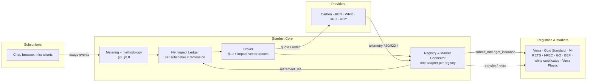

# Multi-attribute impact credits and lifecycle emissions

The architecture for spec v1.2 §22 (renewable energy, water, heat recovery and materials credits) and §8.8 (lifecycle emissions): what they add to Stardust, how they fit the existing Core, and the incremental, non-destructive plan for building them.

**Status:** step 2 is partly built (water split and heat, methodology 0.2); the rest is designed, not yet built. Today Stardust meters the carbon, electricity, water and heat footprint of AI usage, and its broker handles carbon remediation only. Each step below changes that without breaking anything already running.

## What v1.2 adds

### Five impact dimensions, matched like for like (§22.1–§22.2)

| Dimension | Subscriber footprint | Provider benefit | Credit instruments | Unit | Maturity |
|---|---|---|---|---|---|
| Carbon | CO₂e, full lifecycle (§8.8) | Removal or avoidance | Verra VCS, Gold Standard, ACR, CAR, Puro.earth | tCO₂e | Mature |
| Electricity | kWh, by hour and grid region | Renewable generation | RECs (M-RETS, PJM-GATS, WREGIS), EU Guarantees of Origin, I-RECs; EnergyTag granular certificates for hourly matching | MWh | Mature (annual), emerging (hourly) |
| Water | Liters consumed (WUE) | Water restored, recycled or remediated | BEF Water Restoration Certificates (1 = 1,000 gal); WRI Volumetric Water Benefit Accounting | 1,000 gal / m³ | Emerging |
| Heat | Waste heat rejected | Waste heat delivered for reuse | White certificates (France CEE, Italy TEE); carbon credits for displaced fossil heat; ERF (ISO/IEC 30134-6) as the measure | MWh-th / tCO₂e | Emerging, jurisdiction-specific |
| Materials | Embodied hardware, e-waste | Recycling and recovery | Verra Plastic Waste Reduction; e-waste recovery attested by R2 / e-Stewards recyclers | kg / t | Emerging |

The rules that shape the design:

- **Like for like.** A credit only answers a footprint in its own dimension. A water credit never cancels carbon, and a REC is a Scope 2 electricity claim, not a carbon offset.
- **Register, don't issue.** Stardust supplies measurement and MRV data. Registries verify and issue. Stardust never mints credits.
- **One benefit, one claim.** Each serial is retired once, for one beneficiary and one claim period. The same benefit is never sold as two instruments unless the program allows it.
- **Match in time and place.** Electricity is matched within a market boundary (hourly where possible), water within the same or a stressed watershed, heat to a named local recipient.
- **Dimensions are never summed.** The ledger shows them side by side, never as one blended number.

### New provider categories (§22.3–§22.4)

| Code | Category | Example telemetry (raw, then derived) |
|---|---|---|
| `REN` | Renewable energy generator | `GEN` net generation, `SRC` source type, `GLN` grid location, `CTL` curtailment, `EAC` certificate serials |
| `WRR` | Water restoration and recycling | `VTR` treated/recycled, `VRT` returned, `WQI` quality, `WSI` watershed, `WSX` water stress; derived `D-VWB` |
| `HRC` | Heat recovery | `HEX` heat exported, `HST` temperature, `HRP` recipient, `ERF` energy reuse factor, `DFB` displaced fuel; derived `D-HAV` |
| `RCY` | Materials recycling | `MRC` mass recovered, `MTY` material, `COC` chain of custody, `RCS` certification; derived `D-MAV` |

These sit beside the carbon-capture types from §20 (`DAC`, `PSC`, `NBC`, `OBC`). An operator can be a **prosumer**, both a subscriber and a provider (for example, a data center that exports heat). In that case the broker removes any benefit sold as credits from the operator's own claims.

### New Core components (§22.5–§22.6)

- **Net Impact Ledger.** For each subscriber and dimension, it records the gross footprint, the reductions from right-sizing (§21), the credits retired (by instrument) and the residual. It feeds Return-on-Impact reporting and the dashboards.
- **Registry and Market Connector.** Built on the same driver model as the Provider SDK: one adapter per registry behind one interface, so adding a registry never changes provider or subscriber code.

| Connector method | Purpose |
|---|---|
| `connect(registry_id, credentials)` | Account-holder connection to a registry or market |
| `submit_mrv(provider_id, period, package)` | Provider telemetry and evidence to the verifier (issuance path) |
| `get_issuance(provider_id, period)` | Credits issued for a provider and period |
| `list_inventory(category, filters)` | Available credits by category, vintage, geography, matching basis |
| `transfer(serials, to_account)` | Move credits at purchase |
| `retire(serials, beneficiary, claim_period, purpose)` | Retire in the subscriber's name |
| `verify_serial(serial)` | Check a serial against the public registry |

Many registries have no open write API. Early connectors retire through an account holder (AIforE or a licensed partner) and move to API automation where registries allow it.

### Lifecycle emissions (§8.8)

Carbon splits into components that are always reported separately, each with its own confidence tag:

| Code | Component | How it's derived |
|---|---|---|
| `OPE` | Operational inference | Call energy × grid intensity at run time. This is what Stardust computes today as `co2e_g` |
| `FAC` | Facility overhead | `OPE × (PUE − 1)`, from provider/region PUE |
| `TRA` | Amortized training | Training emissions ÷ lifetime tokens × tokens in the call. Always *Estimated*: no provider publishes lifetime tokens |
| `EMB` | Embodied hardware | Hardware emissions × construction share ÷ (hardware life × utilization) |

`OPE + FAC` map to the Software Carbon Intensity operational term and `EMB` to its embodied term. `TRA` is a disclosed extension.

## How it maps onto today's code

| v1.2 concept | Today | Gap |
|---|---|---|
| Carbon footprint | `co2e_g` on every event (= `OPE`) | `FAC`, `TRA` and `EMB` components |
| Electricity footprint | `energy_wh` on every event | Hourly bucketing and market zone for matching |
| Water footprint | `water_ml` on every event, split into `water_onsite_ml` (cooling) and `water_offsite_ml` (electricity generation) | Watershed for place-based matching; per-grid generation water |
| Heat footprint | `heat_rejected_wh` on every event; `heat_recovered_wh` when the facility reports its Energy Reuse Factor | Metered heat export from providers (§22.4 `HEX`) |
| Materials footprint | Not measured (`ewaste_mg` reserved in the schema) | From `EMB` inputs |
| Provider categories | Carbon remediation categories, §20 carbon-capture telemetry | `REN`, `WRR`, `HRC`, `RCY` and the §22.4 fields |
| Broker quotes | `request_quote(co2e_g)` → carbon quotes | Impact-vector baskets, one quote per dimension |
| Orders | Carbon orders with provider, tier, fee, certificate | `credit_category`, `credit_unit`, `registry_id`, `serial_range`, `vintage_period`, `matching_basis`, `claim_type`, `beneficiary`, `retirement_ref` |
| Net Impact Ledger | `/v1/summary` (footprint only) | Retired credits and residual per dimension |
| Registry connectors | None (providers self-attest certificates) | The connector interface and adapters |

## Incremental, non-destructive plan

### Ground rules for every step

1. **Additive only.**
   - New fields are optional, new tables and endpoints are new, and new enum values extend old ones.
   - The carbon path, the current API responses and the event schema keep working exactly as they do.
   - `request_quote(co2e_g)` stays valid forever; the impact vector is an optional alternative.
2. **Migrations add, never rewrite.** Each database change is a new schema version (v3, v4…) made only of `ADD COLUMN`, `CREATE TABLE` and `CREATE INDEX`. Old rows keep `NULL` in new columns. Each migration is rehearsed on a copy of a real database before it ships, as v2 was.
3. **Behind a switch until proven.** New dimensions are off unless listed in `STARDUST_CREDIT_CATEGORIES` (default `carbon`), so turning a dimension on is a configuration change, and so is turning it off.
4. **Methodology is versioned, not edited.** Lifecycle and heat factors go into a new factor file (`methodology-v0.2.json`). Every event records the methodology version it was computed with, so v0.1 figures never silently change.
5. **Contract tests pin today's behavior.** Before the first change, freeze the current API responses (events, summary, quotes, orders) in tests, so any accidental change to existing behavior fails CI.
6. **One small PR per step,** each shippable on its own, with docs updated in the same PR.

### Steps

| # | Step | What changes | What stays untouched |
|---|---|---|---|
| 0 | **Docs** (this change) | Spec v1.2 in `docs/`; this architecture doc | All code |
| 1 | **Contract tests** | Golden tests for the current API and schemas | All behavior |
| 2 | **Measure every dimension** | **Done (methodology 0.2, migration v3):** water split into on-site and off-site; heat rejected, and heat recovered from a reported ERF; OTel attributes and metrics. **Still to do:** `materials_mg` and lifecycle components (`fac_g`, `tra_g`, `emb_g`); hour and market-zone fields for matching (a later migration) | `co2e_g` keeps meaning operational carbon; v0.1 events unchanged |
| 3 | **Net Impact Ledger (read-only)** | `GET /v1/ledger`: footprint per dimension, with retired credits from existing carbon orders and residuals. Nothing summed across dimensions | Summary, orders, broker |
| 4 | **Provider SDK categories** | `REN`, `WRR`, `HRC`, `RCY`; `quote(quantity, unit)` alongside `quote(co2e_g)`; §22.4 telemetry schema as a new record type | Existing carbon providers work unmodified (category defaults to carbon) |
| 5 | **Impact-vector quotes** | `request_quote` optionally takes `{co2e_g, kwh, water_l, heat_kwh_th, materials_kg}` plus matching preferences and returns a basket; like-for-like enforced; fees apply per line. Orders gain the §22.5 fields (a later migration) | `co2e_g`-only requests and responses |
| 6 | **Connector interface + manual connector** | The connector interface, and an "account-holder" connector where an AIforE admin records retirements (serials, registry, retirement reference) done by hand in the registry. The ledger shows them | No automated registry calls yet |
| 7 | **Real connectors, one at a time** | Starting with the registry that grants API access first. Hourly matching once a granular-certificate registry is connected | Other connectors |
| 8 | **Publish the measurement framework** (§22.7) | Schemas, units and mappings (SCI, GHG Protocol, ISO/IEC 30134, VWBA, EnergyTag) as a standalone document for public comment | Code |

Steps 1–4 are safe to build now. Steps 5–7 depend on open questions only AIforE can settle (§19):

- **Legal review** of brokering environmental commodities across markets as a nonprofit.
- **Account holder:** which registries grant programmatic access, and whether AIforE or a licensed partner holds the account.
- **Programs:** which water and heat programs to accept first.

The manual connector (step 6) lets the ledger and the retirement flow be built and tested before any of those are settled.
